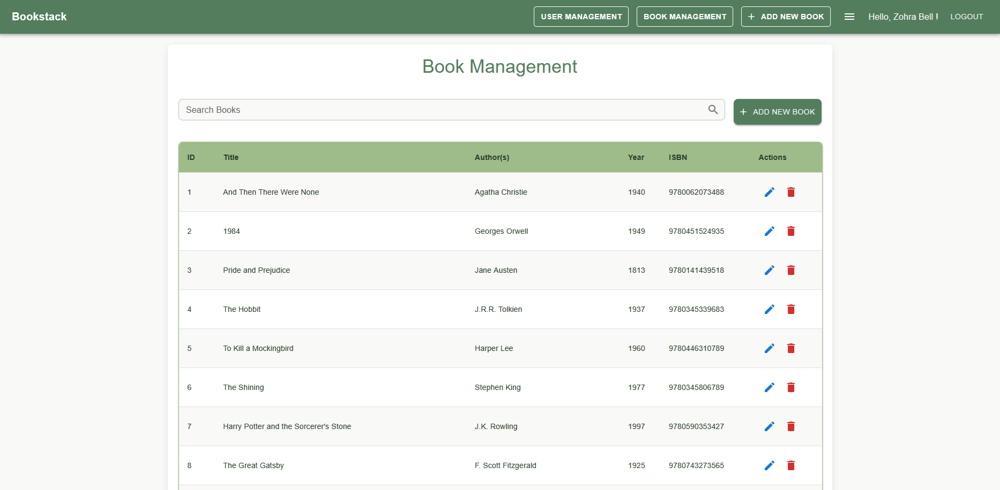
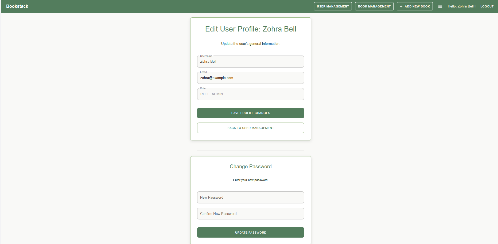
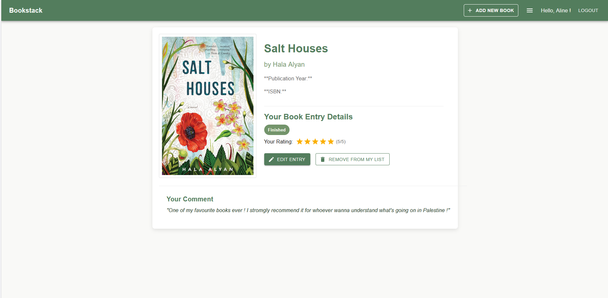

# 📚 Bookstack – Frontend

[](https://vitejs.dev/)
[](https://reactjs.org/)
[](https://www.typescriptlang.org/)
[](LICENSE)

**Bookstack** is a public-facing web application that allows users to track their reading progress, manage wishlists, rate books, and more. This repository contains the **frontend** part of the application, built with **React** and **TypeScript**, using **Material UI (MUI)** for the UI.

---

## 🚀 Key Features

- User authentication (login/register)
- Roles : admin / user
- Book listings with details, ratings, and reading status
- Add books / authors / genres (all users)
- Edit / delete books (admin only)
- Manage reading status (wishlist, to_read, reading, finished)
- Rating and commenting on books
- User profile and book management pages
- Search books by title / by authors
- Filter books by genre / by status

---

## 🧱 Tech Stack

- **Framework**: React 19 + Vite
- **Language**: TypeScript
- **UI Library**: Material UI (MUI)
- **Routing**: React Router v7
- **Backend**: Spring Boot REST API (with Swagger)
- **HTTP**: Axios (via `api/*.ts` services)
- **Type definitions**: Located in `types/`

---

## 📁 Project Structure

```
src/
├── api/ # API services (Axios)
├── assets/ # Images, icons, etc.
├── components/ # Reusable UI components
├── contexts/ # AuthContext
├── pages/ # App pages (views)
├── routes/ # Route definitions
├── styles/ # Global CSS
├── types/ # TypeScript interfaces
├── utils/ # Utility functions
├── App.tsx # Main app component
├── HomeContent.tsx 
├── main.tsx # Entry point

```


---

---

## 📷 Screenshots

Here are a few visual previews of the app in action:


<p align="center">
  
</p>

<p align="center">
  
</p>

<p align="center">
  
</p>

> 📝 *Images are located in `public/screenshots/`*

---

## 📦 Installation

### Prerequisites

- Node.js (v18+ recommended)
- npm or yarn

### Setup

1. **Clone the repository**

```bash
git clone https://github.com/your-username/bookstack-frontend.git
cd bookstack-frontend

## 📦 Installation

### Prerequisites

- Node.js (v18+ recommended)
- npm or yarn

### Steps

1. **Clone the repository**

```bash
git clone https://github.com/your-username/bookstack-frontend.git
cd bookstack-frontend


2. **Install dependencies**

npm install
# or
yarn install

3. **Configure the backend API base URL**
Make sure the API endpoints in the api/*.ts service files point to your backend, e.g.:
const API_BASE_URL = 'http://localhost:8080/api';


4. **Start the development server**
npm run dev
# or
yarn dev


## 🔐 Authentication
Login modal handled in LoginModal.tsx
Role-based access (user/admin)
JWT expected from the backend (you may need to implement token handling with Authorization headers)

## 📌 Potential Improvements

Filter books by users rating
Export personal list
Dark mode with MUI's theming
Unit testing with Jest + React Testing Library

## 🤝 Contributing
Fork the project
Create your feature branch (git checkout -b feature/AmazingFeature)
Commit your changes (git commit -m 'Add some feature')
Push to the branch (git push origin feature/AmazingFeature)
Open a Pull Request

## 🔗 Recommended Frontend
For the complete BookStack application, check out the BookStack Back-end Repository : [https://github.com/zohra-b/S5.02.bookstack](https://github.com/zohra-b/S5.02.bookstack)
